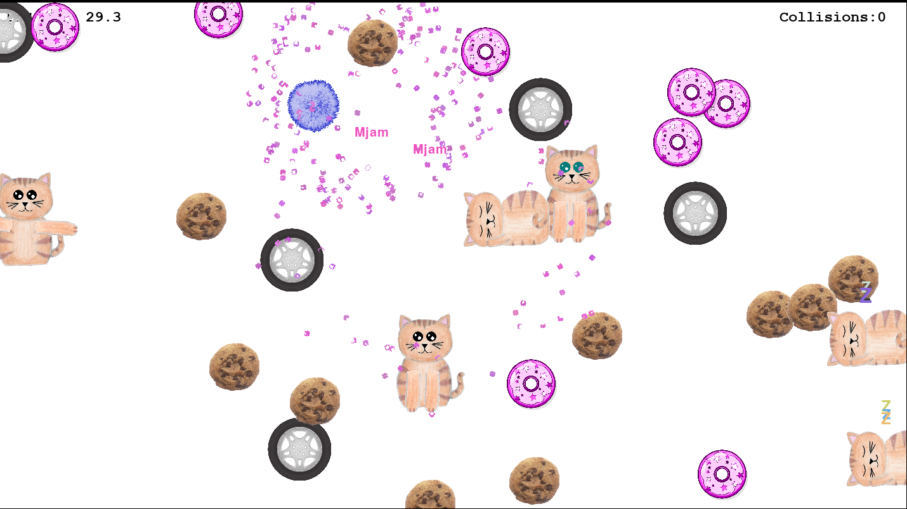

# Fluffball
Made with python3 and pygame 

Fluffball ist ein niedliches Spiel, bei dem man einen kleinen flauschigen Ball steuert
und versucht, so viele leckere Kekse und Donuts zu essen ohne gegen herumliegende Autoreifen 
zu rollen. Dabei muss man spielenden Kätzchen ausweichen (die ein bisschen verrückt sind, denn sie 
denken, sie können fliegen). 

Spielbar für bis zu vier Person.

Um das Spiel zu spielen benötigt man:
 - Python 3  (https://www.python.org/downloads/)
 - Pygame:  python3 -m pip install -U pygame --user

 

